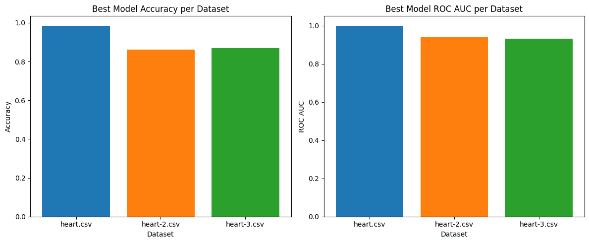
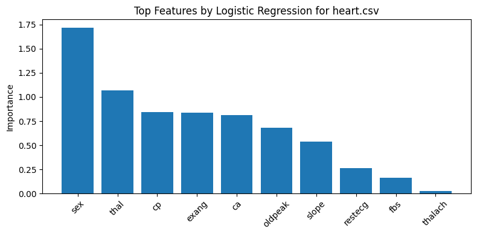
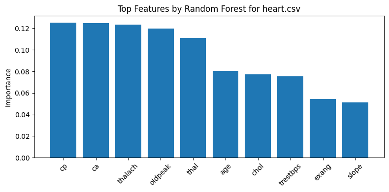
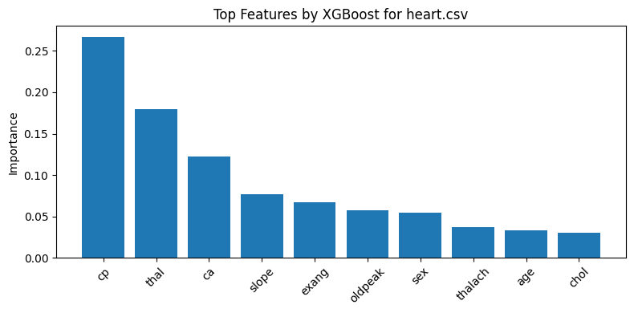
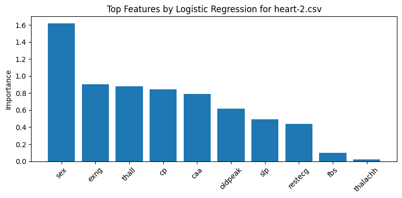
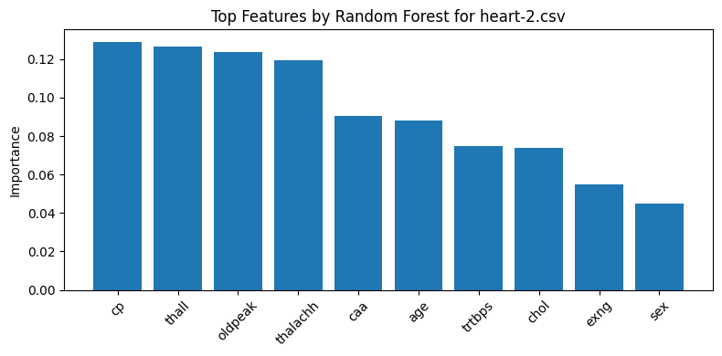
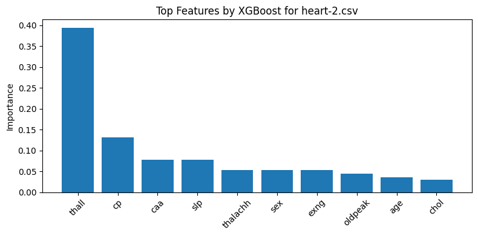
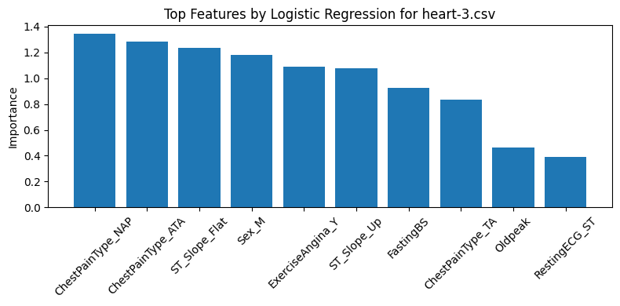
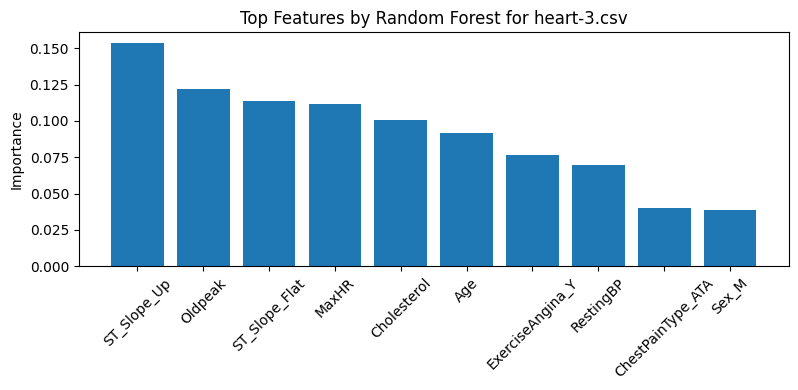
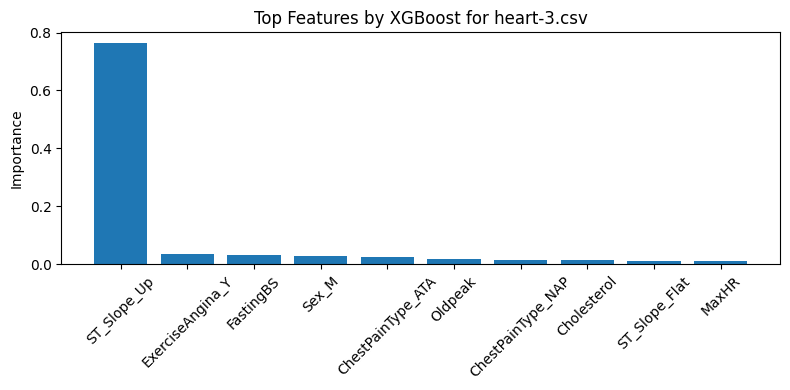

# Heart Disease Risk Prediction

This repository contains a project aimed at predicting the risk of heart disease using machine learning models. The workflow involves comparing multiple datasets and evaluating the performance of various models to identify the most suitable dataset and model for the task.

## Project Overview

This project uses three datasets to train and evaluate machine learning models for heart disease prediction. The datasets are:

1. `heart.csv` ([Source 1](https://www.kaggle.com/datasets/johnsmith88/heart-disease-dataset))
2. `heart-2.csv` ([Source 2](https://figshare.com/articles/dataset/heart_csv/20236848?file=36169122))
3. `heart-3.csv` ([Source 3](https://www.kaggle.com/datasets/fedesoriano/heart-failure-prediction))

## Workflow

### 1. Data Loading and Preprocessing
- Each dataset was loaded and inspected for missing values.
- Missing values were dropped.
- Categorical columns were encoded using one-hot encoding.

### 2. Feature and Target Split
- For each dataset, the target column was identified:
  - `heart.csv`: `target`
  - `heart-2.csv`: `output`
  - `heart-3.csv`: `HeartDisease`
- Features (`X`) and target (`y`) were separated.

### 3. Train-Test Split
- The data was split into training and testing sets using an 80-20 split.

### 4. Model Training and Evaluation
- The following machine learning models were trained and evaluated:
  - Logistic Regression
  - Random Forest
  - Support Vector Machine (SVM)
  - XGBoost
  - K-Nearest Neighbors (KNN)
  - Naive Bayes
- Performance metrics used for evaluation:
  - Accuracy
  - ROC AUC Score

### 5. Dataset Comparison
- Each dataset was evaluated using the above models.
- The performance metrics were compared across datasets.

#### Datasets Quality Overview

#### Model Metrics Comparison

### 6. Feature Importance Analysis
- For models that support feature importance (e.g., Random Forest, XGBoost), the top features contributing to predictions were identified and visualized.

#### Feature Importance for Dataset-Model Combinations
- **Dataset 1**:
  - Logistic Regression: 
  - Random Forest: 
  - XGBoost: 
- **Dataset 2**:
  - Logistic Regression: 
  - Random Forest: 
  - XGBoost: 
- **Dataset 3**:
  - Logistic Regression: 
  - Random Forest: 
  - XGBoost: 

## Results
- Dataset-1 is chosen for making predictions due to its large volume and better model performance
- Random Forest model has been implemented on Dataset-1 due to its consistent performance
- Most important features were identified cooresponding to this model